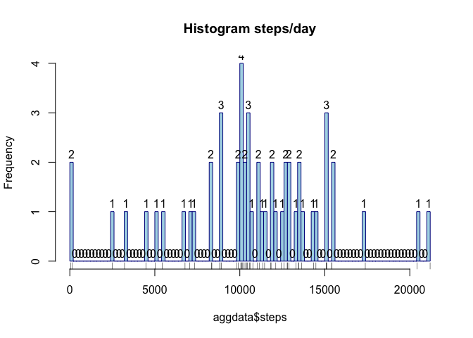
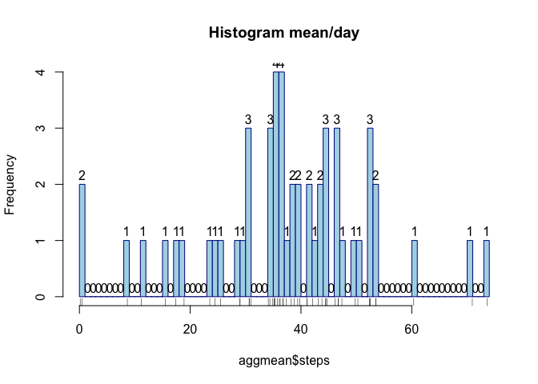
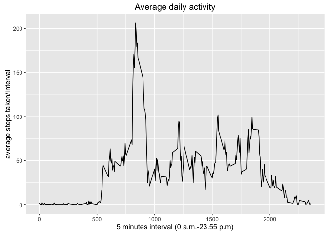
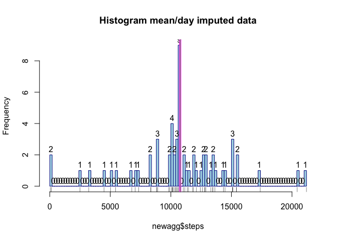
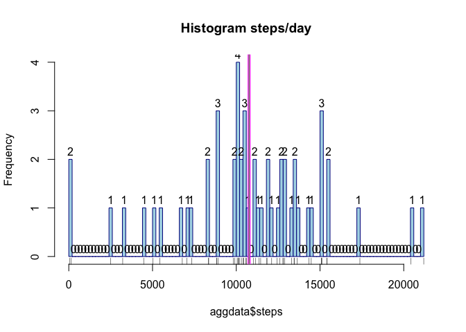
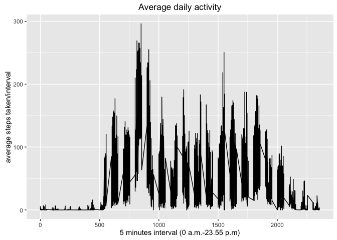

Assignment: Course Project 1
=============================================================================================================================================
---
title: "PA1_template."
author: "Moritz"
date: "7 März 2016"
output: html_document
---

Set working directory to the file where your download data is
setwd("~/...data")


```r
library(plyr)
library(dplyr)
```

```
## 
## Attaching package: 'dplyr'
```

```
## Die folgenden Objekte sind maskiert von 'package:plyr':
## 
##     arrange, count, desc, failwith, id, mutate, rename, summarise,
##     summarize
```

```
## Die folgenden Objekte sind maskiert von 'package:stats':
## 
##     filter, lag
```

```
## Die folgenden Objekte sind maskiert von 'package:base':
## 
##     intersect, setdiff, setequal, union
```

```r
library(ggplot2)
library(lubridate)
```

```
## 
## Attaching package: 'lubridate'
```

```
## Das folgende Objekt ist maskiert 'package:plyr':
## 
##     here
```

Read activity data

```r
data <- read.csv("activity.csv", header = TRUE, sep = ",")
```
## What is the mean total number of steps taken per day?

Aggregate the number of steps per date


```r
aggdata <- aggregate(steps ~ date,data=data,FUN="sum")
x <- hist(aggdata$steps, breaks = 100,labels = T, border = "dark blue",col = "light blue", main="Histogram steps/day")
rug(aggdata$steps)
```



```r
aggmean <- aggregate(steps ~ date,data=data,FUN="mean")
hist(aggmean$steps, breaks = 100,labels = T,border = "dark blue",col = "light blue", main="Histogram mean/day")
rug(aggmean$steps)
```



```r
aggmedian <- aggregate(steps ~ date,data=data,FUN="median")
print("Median total number of steps/day")
```

```
## [1] "Median total number of steps/day"
```

```r
print(head(aggmedian))
```

```
##         date steps
## 1 2012-10-02     0
## 2 2012-10-03     0
## 3 2012-10-04     0
## 4 2012-10-05     0
## 5 2012-10-06     0
## 6 2012-10-07     0
```

## What is the average daily activity pattern?


```r
intermean<- aggregate(steps~interval, data=data, FUN = "mean")
qplot(interval,steps, data=intermean, geom="line", xlim=c(0,2355),main="Average daily activity",xlab = "5 minutes interval (0 a.m.-23.55 p.m)", ylab = "average steps taken/interval")
```



```r
i <- order(intermean$steps) # create order index
iorder <- intermean[i,] # create the ordered vector
print("Maximum number of steps across whole dataset")
```

```
## [1] "Maximum number of steps across whole dataset"
```

```r
print(top_n(iorder,1)) # choose top interval and steps (dplyr)
```

```
## Selecting by steps
```

```
##   interval    steps
## 1      835 206.1698
```
## Imputing missing values

Calculate and report the total number of missing values in the dataset (i.e. the total number of rows with NAs)

```
## [1] "Total number of missing values"
```

```
## [1] 2304
```
Devise a strategy for filling in all of the missing values in the dataset. The strategy does not need to be sophisticated. For example, you could use the mean/median for that day, or the mean for that 5-minute interval, etc.

```r
new <- data
for (i in 1:nrow(new)) {
        if (is.na(new$steps[i])== TRUE) {
                y <- subset(intermean,interval==new[i,3]) # exchange the NAs through the mean per interval
                new[i,1] <- y[,2] 
                #print(new[i,])
        }
}
```
Total number of steps taken per day

```r
newagg <- aggregate(steps ~ date,data=new,FUN="sum")
n <- hist(newagg$steps, breaks = 100,labels = T,border = "dark blue",col = "light blue", main="Histogram mean/day imputed data" )
rug(newagg$steps)
abline(v = median(newagg$steps), col = "magenta", lwd = 4)
abline(v = mean(newagg$steps), col = "green", lwd = 1)
```


Mean total number of steps taken per day

```r
newmean <- aggregate(steps ~ date,data=new,FUN="mean")
```
Median total number of steps taken per day

```r
newmedian <- aggregate(steps ~ date,data=new,FUN="median")
```
Comparison of original data set and imputed data set (steps/day)

```r
hist(aggdata$steps, breaks = 100,labels = T,border = "dark blue",col = "light blue", main="Histogram steps/day")
rug(aggdata$steps)
abline(v = median(aggdata$steps), col = "magenta", lwd = 4)
abline(v = mean(aggdata$steps), col = "green", lwd = 1)
```



```r
hist(newagg$steps, breaks = 100,labels = T,border = "dark blue",col = "light blue", main="Histogram mean/day imputed data" )
rug(newagg$steps)
abline(v = median(newagg$steps), col = "magenta", lwd = 4)
abline(v = mean(newagg$steps), col = "green", lwd = 1)
```


## Are there differences in activity patterns between weekdays and weekends?

Change to POSIXct format with lubridate package


```r
new$date <- ymd(as.character(new$date))
# Add a facotr variable "day" to the dataset "new"
new$day<- weekdays(new$date,abbreviate = TRUE)
# Calculate the mean per interval + day
daymean <- aggregate(steps ~ interval+day,data=new,FUN="mean")
# Plot time series accordingly
qplot(interval,steps, data=daymean, geom="line", xlim=c(0,2355),main="Average daily activity",xlab = "5 minutes interval (0 a.m.-23.55 p.m)", ylab = "average steps taken/interval")
```




